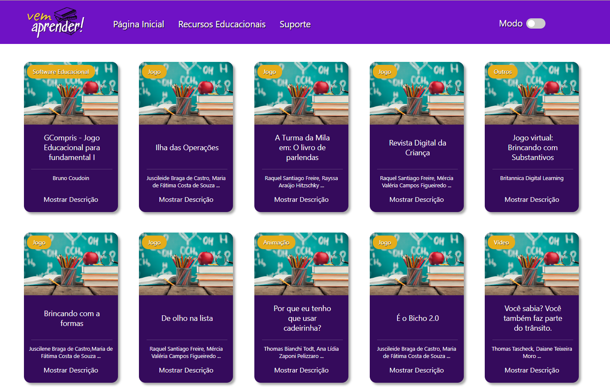

# Desafio V-LAB - Vem aprender!

## Motivação

Este projeto é parte de um modelo de avaliação e recrutamento para o v-lab, no qual, fui desafiado a desenvolver uma aplicação em html + css + JS consumindo uma API.



## Como rodar?

```bash
git clone https://github.com/lsb4/Desafio-V-Lab.git
cd .\Desafio-V-Lab\
.\index.html
```

### Sinta-se a vontade para contribuir!
